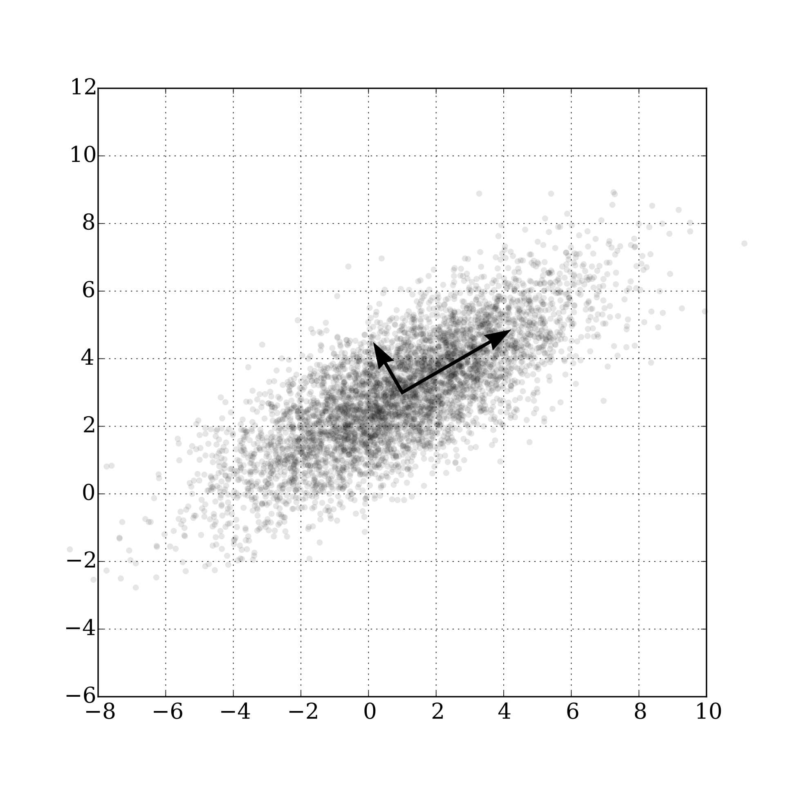

```{r setup, include=FALSE}
knitr::opts_chunk$set(echo = TRUE)
library(latex2exp)
library(mvtnorm)
```

**Todo**

* Run simulation study on synthesized data (- Emphasize on noise, correlation, hyperparameter r, comparing with elbow plots, use the same generated data for the different methods) - document along the way

* Report:

  * Extend [1.3 Simulation dataset description] <span style="color:gray">Eliott</span>
  * Overall conclusion

  
* Polishing:

  * Consider and incorporate "General Feedback for Small Projects" - Manual 11

# Introduction

## Problem description

When dealing with modern large datasets, the observations' dimensionality often becomes a problem regarding the interpretability of the dataset, or for its vizualisation, especially during the data exploration phase. The Principal Component Analysis (PCA) is a statistical technique used to reduce the dimension of the dataset, while trying to keep as much information as possible from the original dataset (i.e. variance). An example of PCA usage is bringing a high-dimension dataset to $\mathbb{R}^2$ or $\mathbb{R}^3$ to vizualise its datapoints and afterwards identifying clusters. It does so by computing Principal components from the dataset and then projecting datapoints to this new basis.

Mathematically speaking, we can define principal components as an orthonormal basis of unit vectors which sequentially capture the most variance in the data. Practically, the PCs can be found with the following optimization problems for a given centered Gaussian dataset $\mathbf x_1,\ldots,\mathbf x_N \in \mathbb{R}^p$: 
\[
\begin{split}
v_1 &= \underset{v, \| v \|=1}{\mathrm{arg\,max}} \mbox{ } v^\top \widehat{\boldsymbol{\Sigma}} v \\
v_2 &= \underset{v, \| v \|=1, v^\top v_1 = 0}{\mathrm{arg\,max}} v^\top \widehat{\boldsymbol{\Sigma}} v \\
&\;\;\vdots
\end{split}
\]

with $\widehat{\Sigma} = N^{-1}\sum_{n=1}^N \mathbf x_n \mathbf x_n^\top \in \mathbb{R}^{p\times p}$ being the empirical covariance matrix of the dataset. More information about Principal component analysis can be found in [Jolliffe, 2002](https://link.springer.com/book/10.1007/b98835) or directly on [Wikipedia](https://en.wikipedia.org/wiki/Principal_component_analysis).


```{r, echo=FALSE, fig.align = 'center', out.width = "25%", fig.cap = "Example of 2 PCs on a given dataset in $R^2$"}

```


This project focuses on finding the optimal number of principal components ($r$), which dictates a trade-off between the model's complexity and its interpretability. In fact, higher the $r$, higher the explained variance, but less interpretable the dataset. To optimally choose the number of PCs, several techniques have been created, such as the method of percentage of variance explained, the scree-plot method or Cross-validation for PCA.

In this report, one will first find a presentation of each Cross-Validation method for PCA with an initial description, followed by a pseudo-code in [2. Cross-validation on PCA methods]. Then, those methods will be ran on simulated datasets with different parameters in [3. Simulation and comparison of CV methods]. Furthermore, the percentage of variance explained and the scree-plots methods will be described and tested in [4. Other PCs number selection methods]. Finally, the conclusion will wrap up the take-home messages as well as next steps which could be conducted regarding this subject.

# Cross-validation on PCA methods

## Naïve Approach

A widely used approach for Cross-validation in PCA is a method that has the right intentions but fails at a critical point :it does not take into account any variance-bias tradeoff, meaning that the optimal solution will always be $r = R$. We start with the usual conventions by denoting $X \in \mathbb{R}^{n \times p}$ our data with $n$ observations and $p$ variables, then as presented in [Notes 06 - T. Masak](https://htmlpreview.github.io/?https://github.com/TMasak/StatComp/blob/master/Notes/06_CV.html#no.-of-component-selection-for-pca), below is the pseudo-code of the Naïve approach:

  * split data $\mathbf{X}$ into $K$ folds $J_1,\ldots,J_K$ (row indices)
  * **for** $k=1,\ldots,K$:
    - solve $\widehat{\mathbf{L}} = \underset{\mathrm{rank}(\mathbf L) = r}{\mathrm{arg\,min}} \|\mathbf X[J_k^c,:] -\mathbf L \|_2^2$
    - calculate $Err_k(r) = \frac{1}{|J_k|}\sum_{m \in J_k} \| x^m - P_{\widehat{\mathbf{L}}} x^m \|_2^2$
  * **end for**
  * choose $\widehat{r} = \underset{r}{\mathrm{arg\,min}} \sum_{k=1}^K Err_k(r)$

A numerical method to solve the least square problem in the top of the algorithm would be to compute the SVD decomposition of $\mathbf X[J_k^c,:]$ and truncate the rank to $r$ by setting the $p-r$ smallest singular values to zero. To estimate $\mathbf{x^{m}}, \forall m \in J_k$ with a lower dimensional version, we project it with the matrix $P_{\mathbf{\widehat{L}}}$ which can be computed via the the R built-in function `prcomp()` the returns among other objects a basis for the dimension of $\widehat{\mathbf L}$. The promised issue occurs when computing the error measure without further to-do. Thus the error obviously shrinks when $\widehat{\mathbf L}$ is allowed to have higher dimensions and converges to $0$ when its number of dimensions equals those of the initial data set $\mathbf{X}$, as the SVD will be a nearly exact representation of the matrix $\mathbf{X}$.

## Artificially turn the unsupervised problem into a supervised one

This method corrects the [2.1 Naïve Approach] by introducing a Bias-Variance trade-off for the $Err_k$ function. Let again $\mathbf{X} \in \mathbb{R}^{n \times p}$ be our Multivariate Gaussian dataset with $n$ observations and $p$ variables, mean $\mu$ and covariance $\Sigma$. As described in [Notes 06 - T. Masak](https://htmlpreview.github.io/?https://github.com/TMasak/StatComp/blob/master/Notes/06_CV.html#no.-of-component-selection-for-pca), we implement this method as below :

  * split data into $K$ folds $J_1,\ldots,J_K$ (row indices)
  * **for** $k=1,\ldots,K$:
    - Compute $\hat{\mu}$ and $\hat{\Sigma} := \hat{\Sigma}_r$ (the empirical estimator truncated to rank r) on $\mathbf{X}\setminus J_k$.
    - Split data points $\mathbf{x}^m\in \mathbb{R}^{p}, m \in J_k$ into a "missing" part $\mathbf{x}_{miss}$ that will be used for validation and an "observed" part $\mathbf{x}_{obs}$ in order to estimate its counterpart
    - Predict the missing part from the observed part using the $\hat{\mu}$ and $\hat{\Sigma}_r$
    - That is compute $\hat{\mathbf{X}}^m_{miss} = \mathbb{E}_{\hat{\mu},\hat{\Sigma}_r}[\mathbf{X}^m_{miss}|\mathbf{X}^m_{obs}=\mathbf{x}^m_{obs}] = \hat{\mu}_{miss} + \hat{\Sigma}_{miss,obs}\hat{\Sigma}^\dagger_{obs}(\mathbf{X}^m_{obs}-\hat{\mu}_{obs})$, where $\hat{\Sigma}^\dagger_{obs}$ is the pseudoinverse of $\hat{\Sigma}_{obs,obs}$ and $\hat{\mu}_{miss},\hat{\mu}_{obs}$ are $\hat{\mu}$ split according to the "missed" and "observed" variable indices.
  * **end for**
  * choose $\widehat{r} = \underset{r}{\mathrm{arg\,min}} \sum_{k=1}^K Err_k(r)$, where for instance $Err_k(r)$ can be considered as the MSE for every fold $J_k$, e.g. $Err_k(r)=\frac{1}{|J_k|}\sum_{m\in J_k} \|\hat{\mathbf{X}}^m_{miss}-\mathbf{X}^m_{miss}\|^2_2$

It is important to emphasize some points of this aforementioned algorithm. When we truncate $\hat{\Sigma}$ to $\hat{\Sigma}_r$ in every fold, we do it by eigenvalue decomposition, then store $\alpha = \sum_{i=r+1}^p \lambda_i$, and then set to zero those $p-r$ smallest eigenvalues. Afterwards, we compute $\hat{\Sigma}_r = U\tilde{V}U^T$ and then add $\alpha / p$ to its diagonal. This is done to smooth the drop of eigenvalues when truncating the covariance estimator and avoid undesirable results of our algorithms. 

Hence, we reduce the rank of the covariance of $\mathbf{X}$, but we preserve its dimension which allows us to estimate $\mathbf{x}^m_{miss}$ in the later part of the algorithm. When splitting the observations in every iteration of the for loop, it naturally comes to mind if we should always take the same or a different (random) split. The first possibility was chosen as that additional random factor would be negligible by the SLLN. Nevertheless, it makes sense to keep two equally sized parts in order to have a proper estimation basis without overestimating. This also gives us a good understanding whether our estimation method will work in harsh conditions, i.e. if half of the data is missing.
When estimating $\hat{\mathbf{x}}^m_{miss}$, the linear estimator is used as it emerges from the law of our data set $\mathbf{X}$. Hence, it is only applicable in this form to Gaussian distributed observations $\mathbf{x} \in \mathbb{R}^p$. The estimation also makes use of the pseudoinverse of $\hat{\Sigma}_{obs,obs}$ denoted by $\hat{\Sigma}^\dagger_{obs}$. We use this convention in order to avoid singularity issues when inverting a block of the truncated covariance estimator. The pseudoinverse is easily callable in R by the function `ginv()` embedded in the `MASS` package.

## Missing data approach

Here it is assumed that the rows $\mathbf{X}_{n} \in \mathbb{R}^p, n=1,…,N$ of the data matrix $\mathbf{X}=(\mathbf{X}_{n,j})^{N,p}_{n,j=1}$ are i.i.d. realizations of a multivariate Gaussian random variable of mean $\mu \in \mathbb{R}^p$ and a covariance $\Sigma \in \mathbb{R}^{p \times p}$. We will assume that rank$(\Sigma)=r$ for $r=1,…,R$, and compare how well different values of $r$ fit the data. As described in [Notes 06 - T. Masak](https://htmlpreview.github.io/?https://github.com/TMasak/StatComp/blob/master/Notes/06_CV.html#no.-of-component-selection-for-pca), this approach is based on computing the estimators $\hat{\Sigma}$ and $\hat{\mu}$ based on observed data by the EM algorithm while the set of missed and observed data is randomly selected at the beginning of the algorithm. Then, it performs more or less the same steps as the previous algorithm to find the optimal number of PCs. Let us now describe the EM algorithm used in our case and then describe the Missing data approach algorithm.

Let $\tilde{X}$ be the dataset containing missing values randomly placed on the original $N \times p$ dataset. The EM algorithm works as follows :

  * Initialize $\hat{\mu} = \frac{1}{N}\sum_{n=1}^N(\tilde{X}^{obs}_{n})$ and $\hat{\Sigma} = I_{p\times p}$, where $\tilde{X}_{obs}$ is the dataset restricted to observed values.
  * Set $\hat{\Sigma}^{old} = C\hat{\Sigma}$, and $tol = 0.01$ for a given constant $C$ big enough to enter the while loop (e.g. $C = 600$)
  * **while** $(||\hat{\Sigma}-\hat{\Sigma}^{old}||_F > tol||\hat{\Sigma}^{old}||_F)$ where $||.||_F$ is the Frobenius norm
    - Set $\hat{\Sigma}^{old} = \hat{\Sigma}$
    - Estimate $\tilde{X}_{miss}^{n}$ by a linear estimator : $\tilde{X}_{miss}^n = \hat{\mu}_{miss} + \hat{\Sigma}_{miss,obs} \hat{\Sigma}_{obs}^{\dagger}(\tilde{X}_{obs}^n-\hat{\mu}_{obs})$
    - Set $\hat{\mu} =\frac{1}{N}\sum_{n=1}^N(\tilde{X}_{n})$, $\hat{\Sigma} = \frac{1}{N-1}\sum_{n=1}^N (\tilde{X}_i-\hat{\mu})(\tilde{X}_i-\hat{\mu})^T$, i.e. the two MLE estimators
  * **end while**
  * return the estimated $\hat{\mu}, \hat{\Sigma}$

This method slightly differs from the one presented in [Notes 05 - T. Masak](https://htmlpreview.github.io/?https://github.com/TMasak/StatComp/blob/master/Notes/05_EM.html), mainly due to poor results when estimating $\hat{\Sigma}$ and light confusion about notations used in the aforementioned implementation. Another matrix approach for the EM algorithm was also tried from [Machine Learning, Murphy](http://noiselab.ucsd.edu/ECE228/Murphy_Machine_Learning.pdf) which gave good results for $\hat{mu}$ but was also unsuccessful when predicting $\hat{\Sigma}$ when $r$ becomes too large.

Below is the pseudo-code for the Missing Data method :

  * split the dataset in $K$ folds $J_1,\ldots,J_K$ (row indices)
  * Compute the bivariate set of missed data $\Omega$
  * **for** $k=1,\ldots,K$:
    - Compute $\hat{\mu}$ and $\hat{\Sigma}$ by the EM algorithm with the dataset $X$ and missing indices $\Omega$
    - Truncate $\hat{\Sigma}$ to a rank $r$ matrix $\hat{\Sigma}_r$ by eigenvalue decomposition.
    - Reuse the missed data $\Omega$ to split the data points $\mathbf{x}^m\in \mathbb{R}^{p}, m \in J_k$ into a "missing" part $\mathbf{x}_{miss}$ that will be used for validation and an "observed" part $\mathbf{x}_{obs}$ in order to estimate its counterpart
    - Estimate the missing part from the observed part with a linear estimator using the $\hat{\mu}$ and $\hat{\Sigma}_r$ as previously described in the last CV method.
  * **end for**   
  * choose $\widehat{r} = \underset{r}{\mathrm{arg\,min}} \sum_{k=1}^K Err_k(r)$, where for instance $Err_k(r)$ can be considered as the MSE for every fold $J_k$, e.g. $Err_k(r)=\frac{1}{|J_k|}\sum_{m\in J_k} \|\hat{\mathbf{X}}^m_{miss}-\mathbf{X}^m_{miss}\|^2_2$
  
  As one can observe, this method is pretty similar to the previous one, except for the computation of the missing values method and the parameters estimation. Here, the missing values are randomly selected across the dataset and can be seen as holes in the dataset, while for the previous CV method, whole columns (aka variables) were taken as missed. Also, as we are now dealing with holes in the dataset, it was not guaranteed that there would be a fully defined estimator for $\Sigma$, compared to the other method for which we could easily select parts of the observed and missed covariance. This forced us to use the EM algorithm for this CV method, as opposed to the other one where a simple $mean$ and $cov$ did the job.

## KDE modified approach
This approach is a modification of the KDE  method from [Notes 06 - T. Masak](https://htmlpreview.github.io/?https://github.com/TMasak/StatComp/blob/master/Notes/06_CV.html#bandwidth-selection-for-kde). Let, as usual, $\mathbf{X}$ be a multivariate Gaussian dataset of size $n \times p$ The goal is to minimize with respect to $R$ the following quantity :

\[
\mathbb{E} \| \widehat{C}_R - C \|_F^2 = \mathbb{E}\| \widehat{C}_R \|_F - 2 \mathbb{E} \langle \widehat{C}_R, C \rangle + \| C \|_F^2
\]

with $\widehat{C}_R$ being the truncated covariance estimator of rank $R$, $C$ being the covariance matrix and $\|.\|_F$ being the Frobenius norm while $\langle X, Y \rangle$ represents the sum of all elements from the Hadamard product of the two matrices $X,Y$, or in mathematical terms : $\langle X, Y \rangle := \sum_{i,j}X_{i,j}Y_{i,j}$.
Assuming that the mean of $\mathbf{X}$ is zero, we get:
\[
\mathbb{E} \langle \widehat{C}_R^{(-n)}, X_n X_n^\top \rangle = \langle \underbrace{\mathbb{E}[ \widehat{C}_R^{(-n)}}_{\approx \mathbb{E} \widehat{C}_R}], \underbrace{\mathbb{E} [X_n X_n^\top}_{ = C}] \rangle \approx \mathbb{E} \langle \widehat{C}_R , X_n X_n^\top \rangle
\]

Therefore, since the truncated covariance estimator is not linear we obtain an approximation, which we will plug back into the initial quantity we wish to minimize. By differentiating the quantity with respect to $R$, we obtain the desired ranking as it will be the only value depending on $R$. Overall, we implement this method as follows for every rank $R$:

* Estimate Covariance $\widehat{C}$ from given data $X$
* Decompose $\widehat{C}$ and set $p-R$ smallest eigenvalues to $0$, then rebuild it to reduce its rank to $R$ ($\widehat{C}_R$)
* Set $Err_R = \|\widehat{C}_R\|_F$
* **for** $j$ in $1,\dots,n$:
  - Compute $\widehat{C}_R^{(-j)}$ by estimating the covariance of $X^{(-j)}$, $j$ being the missing observation in $X$ then truncate it to rank $R$.
  - Subtract $\frac{2}{n}\langle\widehat{C}_R,\widehat{C}_R^{(-j)}\rangle$ from $Err_R$
* **end**
* Choose $R^* = \underset{R}{\mathrm{arg\,min}} \quad Err_R$ according to the minimal error $Err_R$

Stepping into the for-loop we realize that it actually resembles a Leave-One-Out Cross-validation. In this Method we are trading off high computational cost against a stable solution. As shown in the simulations, we will often get negative values for $Err_R$, as one of its components cannot be computed ($\|C\|_F^2$) but was not necessary to find the optimal $R$

## Matrix completion method

This final methods is somehow a bit more general, as we do not need to assume any probability distribution of the data $\mathbf{X} \in \mathbb{R}^{N\times p}$, but just that $X$ has a finite rank. Indeed, for a given data matrix $\mathbf{X}$, we assume that a portion of this matrix is missed and that the remaining elements are observed. Let $\Omega$ be a bivariate index set for the observed data in $\mathbf{X}$. The matrix completion method consists of finding a matrix $\mathbf M$ such that :

\[
    \mathrm{arg \, min}_{\mathbf{M}=(M_{ij})_{i,j=1}^{N \times p}} \sum_{(i,j) \in \Omega} (X_{ij} - M_{ij})^2 \quad \mathrm{s.t.} \quad \mathrm{rank}(\mathbf M)=R
    \]

This optimization method gives us the best matrix $\mathbf M$ with rank $R$ with respect to least-square error on the missed data. However, finding the solution of such a optimization problem is $NP$-hard, so one can use the following iterative algorithm to find local best candidates for the matrix $\mathbb M$ :


  * Select an initial candidate $\mathbf{M}^{(0)}$, here : $M^{(0)}$ is a set of multivariate Guassian random variables with mean $\hat{\mu}_{obs}$ and covariance $I_{p\times p} where $\hat{\mu}_{obs}$ is the empirical mean computed for each column with its respective observed entries of the matrix.
  * Set $l=0$, $tol = 10^{-4}$
  * **do**
    - $l += 1$
    - Compute the SVD of $\mathbf{M}^{(l-1)}$, i.e. $\mathbf{M}^{(l-1)} = UDV^T$
    - Copy $D$ into $\widetilde{D}$ and set the $p-R$ diagonal elements of $\widetilde{D}$ to zero (truncating to rank $R$)
    - Set $\widetilde{M} = U\widetilde{D}V^T$, the new matrix of rank $R$.
    - Set $\mathbf{M}^{(l)}$as : 
    \[
      \mathbf{M}^{(l)} = \begin{cases} X_{ij} \quad \text{for } (i,j) \in \Omega \\
                                       \widetilde{M}_{i,j} \quad \text{for } (i,j) \notin \Omega \end{cases}
      \]
  * **while $\|M^{(l)}-M^{(l-1)}\|_F> tol\|M^{(l)}\|_F$ and $l < 1000$**:
  * Store the error $\sum_{(i,j) \in \Omega} (X_{ij} - M^{(l)}_{ij})^2$ and then repeat this experiment for each value of $R$ from $1$ to $p$, then pick the $R$ which gives the lowest error.
  
  We decided multiply the initial $\|M^{(l)}-M^{(l-1)}\|_F$ stopping criteria by $\|M^{(l)}\|_F$ to take into account the magnitude of the elements in $M$, and added the condition $l<1000$ in case of the algorithm would not converge to the desired tolerance in a reasonable amount of time. In other words, the algorithm stops and returns the matrix $M^{(l)}$ if there was a change of less than $0.01\%$ from the previous matrix $M^{(l-1)}$, or if we go above $1000$ iterations.
    
# Simulation and comparison of CV methods

## Simulation dataset description

After the end of [2. Cross-validation on PCA methods] we will be equipped with multiple approaches which enable us to recover the best amount of dimensions needed to represent data "accurately" of a data set. Intuitively, every method must have its different advantages and draw backs.
In order to get a better feeling on how our Cross-Validation methods behave in different circumstances, we will run a simulation study on a variety of synthesized data sets. This allows us to discover the limits of the different methods used and allow us to conclude and recommend different Algorithms with respect to its underlying data. 
As by construction of our Alogrithms every single one of them besides the [2.1 Naïve Approach], the [2.5 Matrix completion method] is only applicable to Multivariate Gaussian distributed data. Therefore we restrict ourselves to this special distribution and create corresponding data in order to get meaningful results. All in all, we consider $12$ different data sets and compare the results of our five algorithms. Furthermore, we only consider centered Gaussian Multivariate Random variables and create three base data sets, on which we infer four kinds of different noises. The first data set is a standard Multivariate Gaussian data set while the second and third base data sets will rely on a random and structured covariance matrix. We denote our base data sets as $D^{i}_0, D^{i}_1$ and $D^{i}_2$ and $i \in \{1,\dots,3\}$. It consists of data $X=\{X^1,\dots,X^n\}$ and noise $\epsilon^{i}$. The amount of different parameters make it difficult to write get a single big picture of the problem, which is the reason we implemented a Shiny App that lets the reader tune the parameters as he pleases. We strongly recommend to check it out and test the limits of cross-validation for him oder herself. 

\[
D^{i}_0 = X + \epsilon^{i}_p, \text{ where } X^j\sim\mathcal{N}(0, \mathbb{1}_{p\times p}), \forall j = 1,\dots,n\\
D^{i}_1 = X + \epsilon^{i}_p, \text{ where } X^j\sim\mathcal{N}(0, \Sigma_1), \forall j = 1,\dots,n \text{ and } \Sigma_1=M\cdot M^{T}, (M_{ij})_{1\leq i,j\leq p} \stackrel{\text{iid}}{\sim} \mathcal{N}(0,1)\\
D^{i}_2 = X + \epsilon^{i}_p, \text{ where } X^j\sim\mathcal{N}(0, \Sigma_2), \forall j = 1,\dots,n \text{ and } \Sigma_2=M\cdot M^{T}, (M_{ij})_{1\leq i,j\leq p}=\frac{(i-1)p+j}{p}
\]

For the covariance $\Sigma_2$ of $D^{i}_2$ we will get a structured matrix that will emphasize the meaningful position of the last variables. For clarity purposes, we will give an example for $p=3$:

\[
M = 
\frac{1}{9}\begin{pmatrix}
  1 & 2 & 3 \\
  4 & 5 & 6 \\
  7 & 8 & 9 \\
\end{pmatrix}
\implies
\Sigma_2 = \begin{pmatrix}
0.81 & 0.96 & 1.11 \\
0.96 & 1.15 & 1.33 \\
1.11 & 1.33 & 1.56 \\
\end{pmatrix}
\]

In order to have valid comparisons across all of our methods and validate their correctness, we modify $X$. First, we realize that by the random construction of $X$, we can assume that it has full rank $p$. Second, we truncate it to a specific rank $r$, which should be the recommended dimensions of our Algorithms. Due to asymmetry of $X$, we do so by performing a singular value decomposition of $X$ with the built-in `svd()` function. We will set the $p-r$ smallest of its singular values to $0$. This enables us to control the rank of $X$. We realize that $D_2$ is rank $2$ before adding noise. Having adapted $X$, we infer either uniform noise, differing noise or noise that will increase for each variable.

\[
\epsilon^{1}_p\stackrel{\text{iid}}{\sim}\mathcal{N}(0,\sigma^2\mathbb{1}_{p\times p}), \sigma^2=1.5 \\
\epsilon^{2}_p\stackrel{\text{iid}}{\sim}\mathcal{N}(0,\sigma^2\mathbb{1}_{p\times p}), \sigma^2=0.2 \\
\epsilon^{3}_p\stackrel{\text{iid}}{\sim}\mathcal{N}(0, U), U_{ii}\stackrel{\text{iid}}{\sim} \mathcal{U}([0,2]) \text{ and } U_{ij}=0, \text{for } i\neq j \\
\]

We run our simulation with $n=100$ observations per data set and $p=8$ variables. We truncate our data set to rank $r=3$ and repeat our cross-validation $sim=20$ times on the seed $1312$. The methods using classical cross-validation will loop over $K=5$ folds.

## Comparison with respect to noise

For this analysis, we focus on $D_0$ and will vary the noise $\epsilon_i$ for $i \in [1,3]$. Hereafter are the errors for each CV method described in Section 2.

```{r Noise0, echo=FALSE,out.width="80%", fig.align = 'center', fig.width=12,fig.height=8,fig.cap = "Comparison of CV methods on base 0 dataset with different noises as indicated by Noise°1,2 and 3"}

plot_dataset_together_log <- function(method_str,dataset_number){

load(paste0("datasets_plots/",method_str,".Rdata"))

errors <- chosen[[4+dataset_number]]
p <- dim(errors[[1]])[2]

color_p <- c("orange", "darkblue","darkgray")
# compute ylim
ymin <- Inf
ymax <- -Inf
for (j in 1:3){
  candid <- log(colMeans(errors[[j]]))
  if (ymin > min(candid)){
    if (ymin<0){
      ymin <- min(candid)*1.05
    }else{
      ymin <- min(candid)*0.95
    }
  }
  if (ymax < max(candid)){
    ymax <- max(candid)*1.05 
  }
}

plot(1:p, log(colMeans(errors[[1]])), xlab="Rank r", ylab="Error in logscale", main=TeX(paste0(method_str," error on $D_",dataset_number,"$ with respect to noise"), bold=T),type="b",cex.main=1, cex.lab=1.5,cex.axis=1.4,lwd = 2,ylim = c(ymin,ymax),col=color_p[1])

#par(mfrow=c(1,3))
for (j in 2:3){
  lines(1:p, log(colMeans(errors[[j]])), xlab="Rank r", ylab="Error in logscale",type="b",lwd = 2,col=color_p[j])
}
legend("topright", legend=c("Noise n°1", "Noise n°2","Noise n°3"),
       col=color_p,lty = 1, cex=0.8)
}

plot_three <- function(method_str,dataset_number){
  load(paste0("datasets_plots/",method_str,".Rdata"))
  errors <- chosen[[4+dataset_number]]
  p <- dim(errors[[1]])[2]
  color_p <- c("orange", "darkblue","darkgray")
  par(mfrow=c(1,3))
  
  for (j in 1:3){
    plot(1:p, colMeans(errors[[j]]), xlab="Rank r", ylab="Error", main=TeX(paste0(method_str," error on $D^",j,"_",dataset_number,"$"), bold=T),type="b",lwd = 2,col=color_p[j])
  }
}

par(mfrow=c(2,2))
plot_dataset_together_log("Wrong PCA",0)
plot_dataset_together_log("Wrong PCA Improved",0)
plot_dataset_together_log("Missing Data",0)
plot_dataset_together_log("Matrix Completion",0)
```

COMMENTS

```{r NoiseMissing, echo=FALSE,out.width="80%", fig.align = 'center', fig.width=12,fig.height=4,fig.cap = "KDE Approach for base 0 dataset with different noises as indicated by Noise°1,2 and 3"}
plot_three("KDE Approach",0)
```

COMMENTS

## Comparison with respect to initial covariance matrix 

```{r Datasets, echo=FALSE,out.width="80%", fig.align = 'center', fig.width=12,fig.height=8,fig.cap = "Comparison of CV methods on different dataset for Noise n°1 (low noise)"}

plot_wrt_covariance <- function(method_str,noise){
    
  load(paste0("datasets_plots/",method_str,".Rdata"))
  
  errors <- list(chosen[[4]],chosen[[5]],chosen[[6]]) # D_0,D_1,D_2
  p <- dim(errors[[1]][[1]])[2]
  
  color_p <- c("orange", "darkblue","darkgray")
  # compute ylim
  ymin <- 0
  ymax <- -Inf
  for (j in 1:3){
    candid <- log(colMeans(errors[[j]][[noise]]))
    if (ymin > min(candid)){
      ymin <- min(candid)*1.05
    }
    if (ymax < max(candid)){
      ymax <- max(candid)*1.05 
    }
  }
  
  plot(1:p, log(colMeans(errors[[1]][[noise]])), xlab="Rank r", ylab="Error in logscale", main=TeX(paste0(method_str," error with Noise n°", noise," with respect to covariance"), bold=T),type="b",cex.main=1, cex.lab=1.5,cex.axis=1.4,lwd = 2,ylim = c(ymin,ymax),col=color_p[1])
  for (j in 2:3){
    lines(1:p, log(colMeans(errors[[j]][[noise]])), xlab="Rank r", ylab="Error",type="b",lwd = 2,col=color_p[j])
  }
  
  legend("topright", legend=c(TeX("$D_0$"),TeX("$D_1$"),TeX("$D_2$")),
         col=color_p,lty = 1, cex=0.8)
  
}

par(mfrow=c(2,2))
plot_wrt_covariance("Wrong PCA",1)
plot_wrt_covariance("Wrong PCA Improved",1)
plot_wrt_covariance("Missing Data",1)
plot_wrt_covariance("Matrix Completion",1)

```

COMMENTS

# Other PCs number selection methods

## Percentage of variance explained method

The percentage of variance explained method is based on the dataset's covariance matrix, and its eigenvalues and the total variability (sum of diagonal entries of the covariance matrix). When computing the PCs for a given dataset $\mathbf{X} \in \mathbb{R}^{N \times p}$ of covariance $\Sigma$, we create an orthonormal basis with a corresponding diagonal covariance matrix $\Sigma_{PCA}$ with its entries being the eigenvalues of corresponding PCs. As we sequentially construct the components, the eigenvalues $\lambda_1, \lambda_2, ... ,\lambda_p \in \mathbb{R}$ of the new matrix will be a decreasing sequence. The method of percentage of variance explained is simply to select the first $r$ components such that $\frac{1}{V}\sum_{i=1}^r \lambda_i \ge \tau$ for an arbitrary threshold $\tau \in [0,1]$ and a total variability $V = \sum_{i=1}^p \lambda_i = tr(\Sigma_{PCA})$. Below are a few examples on the method on $D_0$:

```{r percent, echo=FALSE,out.width="80%", fig.align = 'center', fig.width=8,fig.height=4,fig.cap = "Eigenvalues of the PCA covariance matrix, with a treshold of 90% for $D_0$ with respect to noise"}
  source("percent_var.R")
  n <- 100
  p <- 8
  K <- 5
  sim <- 5
  r <- 3
  noise <- c(0.02,0.001,0.005)
  set.seed(1312)
  df <- rmvnorm(n = n, mean = rep(0, p), sigma = diag(p))
  df_svd <- svd(df)
  df_svd$d[-(1:r)] <- 0
  last_sv <- df_svd$d[r]
  df <- df_svd$u %*% diag(df_svd$d) %*% t(df_svd$v)
  D_0 <- list(df + rmvnorm(n = n, mean = rep(0, p), sigma = noise[1]*last_sv*diag(p)),
              df + rmvnorm(n = n, mean = rep(0, p), sigma = noise[2]*last_sv*diag(p)),
              rmvnorm(n = n, mean = rep(0, p), sigma = diag(runif(n = p, min = 0, max = noise[3]*last_sv))))
  
  par(mfrow=c(1,3))
  for (i in 1:3){
    D <- D_0[[i]]
    pcaD<-prcomp(D)
    Sig_pcaD <- cov(pcaD$x)
    eig_pca <- eigen(Sig_pcaD)
    print(eig_pca$values)
    plot(1:p,eig_pca$values,main=TeX(paste0("Eigenvalues of the PCA covariance, $D_0^",i,"$")),type="b",ylab="Eigenvalue",
         xlab="PCs")
    legend("topright",y=c(paste0("Optimal value of r found : ",percent_var(Sig_pcaD))))
  }  
```

## Scree-plot method

The Scree-plot is again related to the eigenvalues of the newly created orthonormal basis of PCs. As shown in the above, the eigenvalues corresponding to the PCs are a decreasing sequence, as seen on the graph above. The Scree-plot method consists of choosing the value of $r$ which corresponds to the elbow of the eigenvalue graph. With $100$ and $8$ variables we get an overview to which extent every single value contributes to the variance of the data set as a whole.

```{r scree0, echo=FALSE,out.width="90%", fig.align = 'center', fig.width=12,fig.height=4,fig.cap = "Scree plot on $D_0$ with different noises as indicated by 1,2 and 3"}
  
par(mfrow=c(1,3))
  for (i in 1:3){
    D <- D_0[[i]]
    eigen_sig<-eigen(cov(D))
    plot(1:p,eigen_sig$values,main=TeX(paste0("Eigenvalues of the $D_0^",i,"$ covariance")),type="b",ylab="Eigenvalue",
         xlab="PCs")
    }
```

We can clearly see that the first three plots singular values are much bigger then the latter ones. In every plot the first three singular values only decrease slightly until the $4$th, where we can observe a strong drop. From the $4$th on the values decrease in the same manner as the first $3$. In this circumstances the [Scree-plot method (non-automatic)] would favor the $4$th value as this value initiates the elbow characteristic of the graphs in every single one of the graphs. This selection would unfortunately be the wrong one as by construction, e.g. truncation of our data set we were expecting the third singular value to initiate the "elbow" form.


As seen below, the "Elbow-Plot" of our data set with a random matrix as covariance has a somehow similar shape. The first eigenvalue however explains much more on the overall variance of our data set. It drops strongly until the second, where the graph seems to stabilize. This behaviour holds on until the third singular value, whereafter we observe a similar drop and decreasing behaviour as in the previous plot. As we already concluded in Figure \@ref(fig:scree0), the [Scree-plot method (non-automatic)] would favor a wrong value.

```{r scree1, echo=FALSE, fig.align = 'center', out.width = "90%", fig.width=12,fig.height=4, fig.cap = "Scree plot on $D_1$ with structured matrix as covariance with different noises as indicated by 1,2 and 3"}

set.seed(1312)

mat <- matrix(rnorm(p*p, mean = 0, sd = 1), nrow = p, ncol = p)
df <- rmvnorm(n = n, mean = rep(0, p), sigma = mat %*% t(mat))
df_svd <- svd(df)
df_svd$d[-(1:r)] <- 0
last_sv <- df_svd$d[r]
df <- df_svd$u %*% diag(df_svd$d) %*% t(df_svd$v)
D_1 <- list(df + rmvnorm(n = n, mean = rep(0, p), sigma = noise[1]*last_sv*diag(p)),
            df + rmvnorm(n = n, mean = rep(0, p), sigma = noise[2]*last_sv*diag(p)),
            rmvnorm(n = n, mean = rep(0, p), sigma = diag(runif(n = p, min = 0, max = noise[3]*last_sv))))

par(mfrow=c(1,3))
  for (i in 1:3){
    D <- D_1[[i]]
    eigen_sig<-eigen(cov(D))
    plot(1:p,eigen_sig$values,main=TeX(paste0("Eigenvalues of the $D_1^",i,"$ covariance")),type="b",ylab="Eigenvalue",
         xlab="PCs")
    }
```

The scree plot of $D_2$, however looks more promising as we get a sharp drop after the first value for every kind of added noise. Therefore choosing the optimal rank $r$ according to the [Scree-plot method (non-automatic)] would coincide with the true rank of data set (which was by construction $2$ regardless of the amount of observations and variables) ++TRUE?!

```{r scree2, echo=FALSE, fig.align = 'center', out.width = "90%", fig.width=12,fig.height=4, fig.cap = "Scree plot on $D_2$ with structured matrix as covariance with different noises as indicated by 1,2 and 3"}

set.seed(1312)

mat <- matrix(1:p^2, nrow = p, ncol = p)/p
df <-  rmvnorm(n = n, mean = rep(0, p), sigma = mat %*% t(mat))
df_svd <- svd(df)
df_svd$d[-(1:r)] <- 0
last_sv <- df_svd$d[r]
df <- df_svd$u %*% diag(df_svd$d) %*% t(df_svd$v)
D_2 <- list(df + rmvnorm(n = n, mean = rep(0, p), sigma = noise[1]*last_sv*diag(p)),
            df + rmvnorm(n = n, mean = rep(0, p), sigma = noise[2]*last_sv*diag(p)),
            rmvnorm(n = n, mean = rep(0, p), sigma = diag(runif(n = p, min = 0, max = noise[3]*last_sv))))

par(mfrow=c(1,3))
  for (i in 1:3){
    D <- D_2[[i]]
    eigen_sig<-eigen(cov(D))
    plot(1:p,eigen_sig$values,main=TeX(paste0("Eigenvalues of the $D_2^",i,"$ covariance")),type="b",ylab="Eigenvalue",
         xlab="PCs")
    }
```

## Comparison with CV methods
Compared to CV methods described in [Cross-validation on PCA methods], those methods are relatively easy to implement, efficient as there is only a eigenvalue decomposition of the covariance matrix which is computationnally expensive and pretty interpretable. However, those methods are not well generalizable if there is some missing values in the dataset or if the eigenvalues do not follow a clear elbow pattern (for the scree-plot).

# Conclusion

In conclusion, several methods for choosing the optimal number of components has been presented. We could observe the behavior of those CV methods depending on the noise and the structure of covariance matrices thanks to simulation on various datasets. We concluded that some methods are more robust to noise (EXAMPLE) while other tend to give poor results when confronted to noise (EXAMPLE). Moreover, we had to assume that our dataset was a centered multivariate Gaussian for every method to be comparable, however, some methods generalize better to other type of dataset's distribution (Matrix Completion for example) while others are more restrictive (EXAMPLE). Computationwise, some methods are more efficient than others (EXAMPLE) and, assuming that all conditions are met to use those methods, the most efficient ones are therefore favoured when working for bigger datasets.